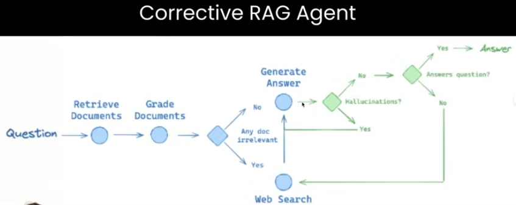

# LocalRAGent

This is an attempt at building an Agentic RAG system using the Llama3 model.

## Data Cleaning

For RAG to work properly, it is very important that the data is thoroughly cleaned, preprocessed, and converted to a suitable format for the RAG models to extract information. Formatting PDFs, PowerPoints, and other non-traditional, non-textual data sources is messy and often erroneous, making it difficult for the LLM to extract relevant information from the document.

Generic parsers often struggle with tabular and unstructured data retrieval. So I've used [LlamaParse](https://github.com/run-llama/llama_parse) - a custom API by LlamaIndex for efficient context augmentation. For website data, I've used [FireCrawl](https://www.firecrawl.dev/) for web crawling. 

## Hybrid Search

Combining vector search for context-based, semantic search for documents with keyword search to highlight sections, taglines, statements, statistics, etc. to improve the quality of retrieved information. 

## Reranking

For optimal prediction and reducing the overload due to slighyl less relevant chunks retrieved by the RAG, I've used a reranking algorithm. We rank the relevant chunks into the decreasing order of vector search similarity scores (i.e. relevance scores) and choose the 'top_k' chunks. 

## Agentic RAG

We can utilise the agents' dynamic and reasoning ability decide the optimal RAG pipeline. An approach I have used is Agentic Query Translation that converts complex questions into simpler step-back questions.

We can also perform metadata filtering and routing to focus on specific metadata-based searching.

## Corrective Pipeline

Corrective RAG allows us to evaluate the quality of the retrieval via knowledge refinement. 

